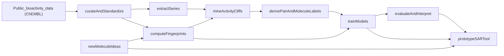

### High-level approach

- **Overall objective**: Build a **research prototype** that (a) mines public medchem data for activity cliffs, (b) trains a model to recognize cliff-like structure–activity behavior, and (c) exposes this via simple analysis/visualization so you can understand which regions of a molecule are cliff-prone and prioritize design ideas.
- **Scope**: Focus on a **single, reproducible Python pipeline** that runs on your 4070, using public sources like **ChEMBL** (and optionally PubChem/BindingDB) and standard chem-informatics tooling (RDKit, PyTorch or scikit-learn).
- **Key pieces**:
  - Data ingestion & curation (extract per-target SAR series, normalize activities).
  - Definition & mining of activity cliffs (pairwise or matched-molecular-series style).
  - Modeling strategies to capture “cliff-ness” (supervised classification/regression and contrastive/metric learning).
  - Evaluation & visualization targeted at SAR analysis and compound-prioritization.

### 1. Data sourcing and curation

- **Pick primary source**
  - Start with **ChEMBL** releases (downloadable as SDF/TSV/SQLite). This gives broad SAR coverage with target annotations.
  - Optionally add **BindingDB** later if you need more bioactivity data for specific target classes.
- **Define project-level constraints**
  - Limit initial experiments to **1–3 target classes** (e.g., GPCR, kinase, protease) to keep compute and cleaning manageable.
  - Only use **single-target, well-annotated assays** (clear target, primary assay flag, consistent units like nM/µM).
- **Curation steps (scripted)**
  - Extract records for chosen targets, filter to:
    - Reliable activity types (e.g., **pIC50, pKi, pEC50** or convert IC50/Ki/EC50 to pX).
    - Valid activity range (exclude obvious outliers, > 10 µM if considered inactive, etc.).
    - Standardized SMILES, salt-stripped parent molecules.
  - Deduplicate molecules per target, aggregating multiple measurements (mean/median pX, record count, assay IDs).
  - Save curated tables like `[data/chembl_curated_<target>.parquet]` with columns: `mol_id`, `target_id`, `canonical_smiles`, `pActivity`, `n_measurements`, `assay_info`.

### 2. Representations and basic SAR structure

- **Molecular representation**
  - Use **RDKit** to compute:
    - Standard 2D fingerprints (e.g., **ECFP4**, 2048 bits) for fast pairwise similarity.
    - Optional phys-chem descriptors (cLogP, TPSA, MW, HBA/HBD, rings) for model features.
  - Store fingerprints & descriptors alongside the curated tables (e.g., NumPy arrays / PyTorch tensors).
- **Series extraction**
  - For each target, cluster compounds by similarity (e.g., Butina clustering on Tanimoto distance) to form **chemotype-level SAR series**.
  - Alternatively, use Bemis–Murcko scaffolds to group molecules into series; keep only series with **≥ 10 compounds** to have meaningful SAR.
  - Persist series definitions: a mapping `series_id → [mol_ids]` for downstream activity-cliff mining.

### 3. Defining and mining activity cliffs

- **Formalize an activity-cliff metric**
  - Use a standard definition: two molecules form a **cliff pair** if:
    - Their Tanimoto similarity on ECFP4 is **≥ S_min** (e.g., 0.8–0.9).
    - Their (\Delta)pActivity = |pActivity_i − pActivity_j| is **≥ D_min** (e.g., 1–2 log units).
  - Optionally, define a **cliffness score** per pair: `cliff_score = ΔpActivity / (1 − sim)` to emphasize large activity jumps in highly similar regions.
- **Efficient pairwise search**
  - For each series/target:
    - Build a similarity search index (e.g., Tanimoto-based nearest neighbors using RDKit or Faiss with bit-vectors).
    - For each molecule, retrieve neighbors above S_min; compute (\Delta)pActivity and flag cliff pairs.
  - Store results in a `cliff_pairs` table: `mol_i`, `mol_j`, `sim`, `ΔpActivity`, `cliff_label (0/1)`, `cliff_score`.
- **Matched Molecular Pair / Series view (optional)**
  - Use an RDKit MMP algorithm to identify **matched molecular pairs/series** where only a local transformation differs.
  - For each local transformation, compute the distribution of activity changes; label transformations that frequently lead to cliffs.

### 4. Labeling schemes and learning targets

- **Per-pair prediction task**
  - Treat each high-similarity pair as a data point with:
    - Input: concatenation or difference of fingerprints / learned embeddings of the two molecules.
    - Target: **binary cliff label** (cliff vs non-cliff) and/or **regression** on (\Delta)pActivity.
- **Per-molecule “cliff propensity” task**
  - Derive a **molecule-level label** such as:
    - `max_cliff_score` over all its pairs.
    - Number or fraction of neighbors that form cliffs.
  - Train models to predict **cliff propensity** from a single molecule representation, so you can score untested ideas.
- **Per-fragment/atom sensitivity (for interpretation)**
  - For each molecule, map pairwise cliffs onto **atoms or fragments** that change between the pair.
  - Aggregate per-atom/per-fragment contributions across multiple cliffs to build **heatmaps of cliff-sensitive regions** for each scaffold/series.

### 5. Modeling strategies (within 4070 constraints)

- **Baselines (low risk, quick)**
  - **Classical ML** on fingerprints & descriptors:
    - Train models (e.g., XGBoost, random forest, logistic regression) for cliff vs non-cliff and for (\Delta)pActivity.
    - Evaluate per-target and cross-target to estimate generalization.
  - **Nearest-neighbor heuristic** baseline:
    - For a new molecule, estimate cliff risk from distribution of neighbor (\Delta)pActivity values.
- **Neural models (GPU-leveraged)**
  - Start with lightweight **MLPs** on ECFP4/descriptor vectors for pair and single-molecule tasks.
  - Progress to **graph neural networks (GNNs)** using a library like PyTorch Geometric / DGL:
    - GNN to embed molecules → projection head.
    - **Contrastive / metric-learning objective** to pull non-cliff pairs together and push cliff pairs apart in embedding space.
  - Use your 4070 to train **per-target** and **multi-target** models, monitoring memory and batch sizes.
- **Training mechanics**
  - Split data per target into train/val/test at **series/scaffold level** to avoid trivial leakage.
  - Implement class re-balancing or focal loss to handle cliff vs non-cliff imbalance.
  - Log experiments with a simple tracker (e.g., TensorBoard or Weights & Biases) and store checkpoints for the best validation metrics.

### 6. Evaluation protocols tailored to activity cliffs

- **Pair-level evaluation**
  - Metrics: ROC-AUC, PR-AUC for cliff classification; RMSE/MAE and correlation for (\Delta)pActivity prediction.
  - Inspect **calibration** (e.g., reliability plots) so that “high cliff probability” is actionable.
- **Molecule-level evaluation**
  - Rank molecules by predicted cliff propensity and compare vs observed `max_cliff_score` in held-out series.
  - Quantify how well the model identifies **series regions where design is risky or promising**.
- **Visualization of SAR and cliffs**
  - For key series, visualize:
    - SAR plots (pActivity vs design index) annotated with cliff pairs.
    - Networks/graphs where nodes are compounds and edges are cliff pairs; highlight communities of cliff-prone compounds.
- **Interpretability**
  - Use techniques such as:
    - **Atom-level attribution** (e.g., integrated gradients for GNNs) to show which atoms drive cliff predictions.
    - Fragment-level enrichment analysis: which R-groups or transformations have high observed cliff frequencies.

### 7. Practical prototype for SAR and idea prioritization

- **Core API (Python-first)**
  - Functions for:
    - Ingesting a CSV of candidate SMILES for a given target/series.
    - Applying trained models to compute per-molecule cliff propensity and, if possible, local sensitivity maps.
    - Returning ranked lists and annotations that plug into your medchem workflow.
- **Minimal UI / workflow**
  - Start with a **notebook-based** interface:
    - Cells that: load a series, mine cliffs, train a quick model, then visualize key scaffolds with cliff heatmaps.
  - Optionally wrap this in a **small web app** (e.g., Streamlit) later for interactive browsing of SAR series and cliff regions.
- **Integration with generative design (future)**
  - Expose a simple scoring function for generated molecules:
    - Given a proposed molecule and a series, return: predicted activity (if you also have QSARs) and **cliff-risk score**.
  - Use this as a **filter or exploration guide**: prefer ideas in controllable regions, or deliberately search for cliff regions if that’s your strategy.

### 8. Project structure and reproducibility

- **Suggested repo layout**
  - `data/`: raw and curated data (with subfolders for ChEMBL, processed series, cliff_pairs).
  - `notebooks/`: exploratory notebooks (data curation, cliff mining, model prototyping, SAR examples).
  - `src/`:
    - `data/chembl_loader.py`: download & curate ChEMBL.
    - `cliffs/miner.py`: pair identification and cliff metrics.
    - `features/featurizer.py`: RDKit fingerprints & descriptors.
    - `models/`: ML/GNN model definitions and training loops.
    - `analysis/visualization.py`: SAR plots, cliff networks, atom-importance views.
  - `scripts/`: CLI utilities for batch runs (e.g., `mine_cliffs.py`, `train_model.py`, `score_candidates.py`).
- **Environment and dependencies**
  - Use **conda or mamba** to manage Python + RDKit + PyTorch:
    - Pin versions compatible with CUDA on your 4070.
  - Provide a `environment.yml` or `requirements.txt` and a brief `README` describing setup and basic usage.

### 9. Milestones (for a 3–6 month prototype)

- **Milestone 1 (week 1–2)**: Download/curate ChEMBL for 1–2 targets, compute fingerprints, and mine basic activity cliffs (pair table + simple visualizations).
- **Milestone 2 (week 3–4)**: Implement baseline ML models for cliff vs non-cliff prediction, evaluate per-target, and verify they outperform simple similarity heuristics.
- **Milestone 3 (month 2)**: Add GNN-based or contrastive models on your GPU and implement molecule-level cliff propensity scoring.
- **Milestone 4 (month 3–4)**: Atom/fragment-level sensitivity analysis and visualization of cliff regions on key scaffolds.
- **Milestone 5 (month 5–6)**: Wrap into a small SAR-analysis prototype (notebooks / simple app) that takes a CSV of ideas and returns prioritized lists plus explanations.

### 10. Optional architecture diagram

Here is a conceptual end-to-end flow you can refine later:

